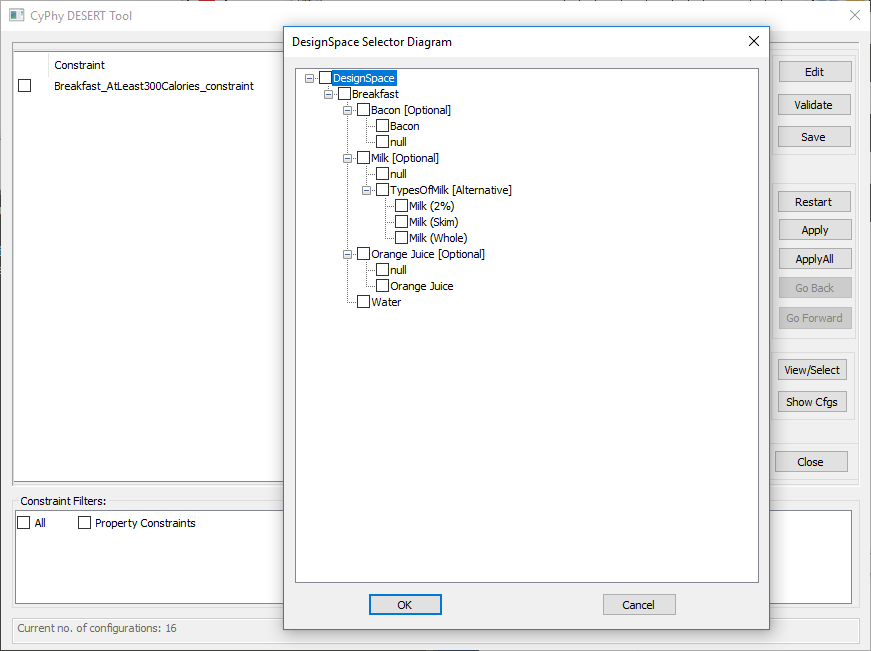
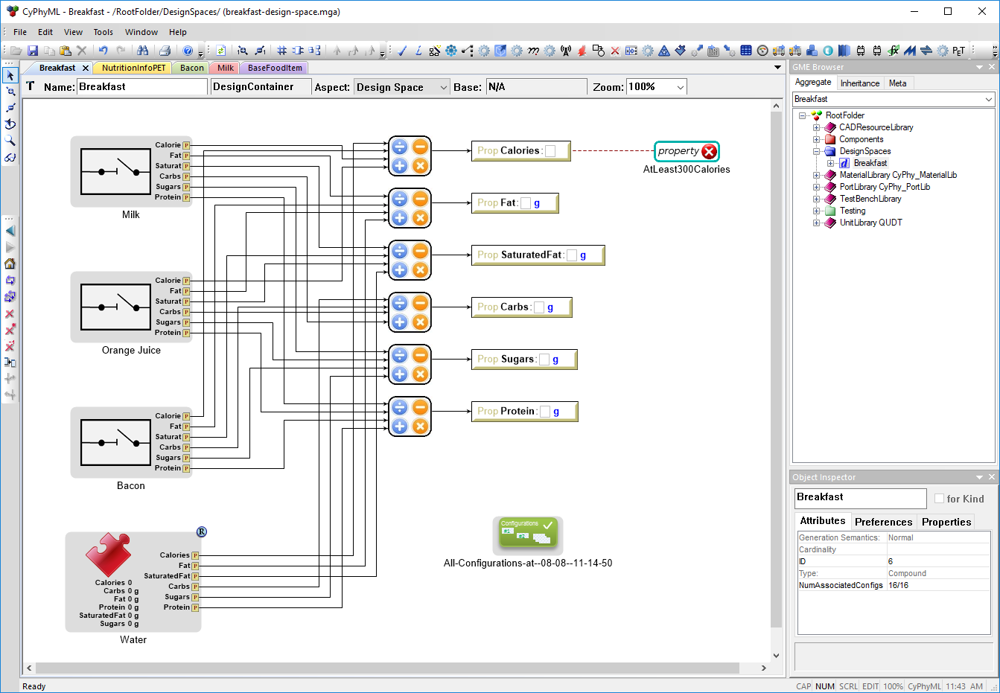
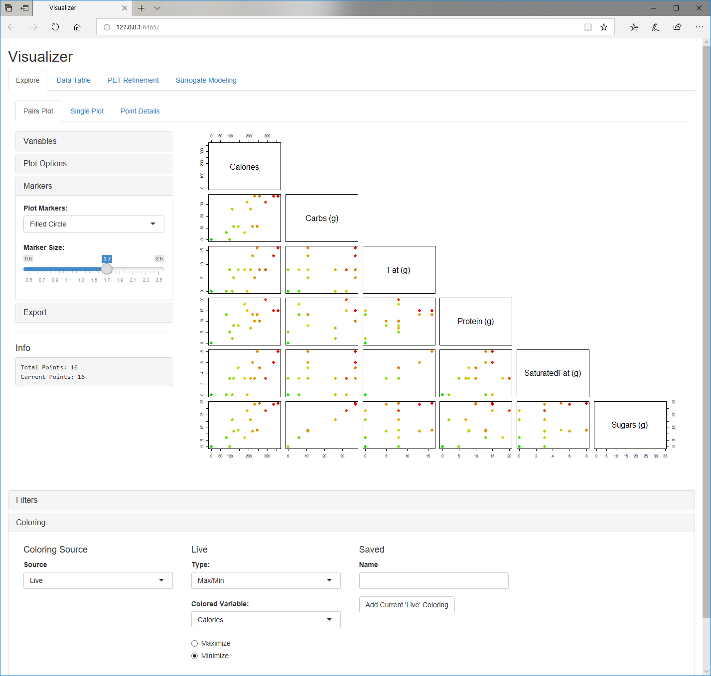

# breakfast-design-space
This OpenMETA project demonstrates the variability structures and constraints available as part of the Design Space feature. It's organized around the theme of deciding what to eat for breakfast based on nutrition and preferred combinations.

## Design Space Structure
- Milk (optional)
	- Types Of Milk (alternatives)
		- Milk (skim)
		- Milk (2%)
		- Milk (whole)
- Orange Juice (optional)
- Bacon (optional)
- Water (required)

This yields 16 possible combinations of decisions.

As viewed in the interactive design space interface:

## Properties
Each food or beverage item includes nutrition values for:
- Calories
- Fat
- Saturated Fat
- Carbs
- Sugars
- Protein

Nutrition info for each item are taken from the 1-serving stats found on MyFitnessPal.
https://www.myfitnesspal.com/food/calorie-chart-nutrition-facts

The top-level Breakfast design space container combines the nutrition values of each item. For each configuration, there will be an overall count available for each of these nutrition values.

 
*overall breakfast design space, aggregation of nutrition values, and constraint, as shown in the OpenMETA model editor*

## Constraints
Current constraints includes:
- At Least 300 Calories in whole meal

Constraints may be written against overall nutrition targets, compatibility preferences, or other criteria.
The application of individual constraints is up to the user to decide -- they can apply as many or as few constraints as they like.

More ideas for constraints:
- Low-Carb breakfast (under 5 grams)
- If coffee or cereal is chosen, milk must also be chosen
- Price thresholds based on cost of each item

## Building Trade-Off Visualizations
OpenMETA's execution capability can calculate the nutrition details for each selected configuration, and its visualizer can produce plots of this data.

The scatterplot matrix shows each nutrition variable plotted against each other variable. Each plot point is a distinct breakfast menu (combination of decisions). The points are colored, with green being low-calorie and red being high-calorie.

