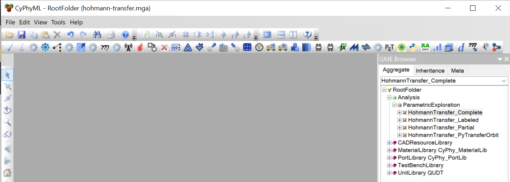
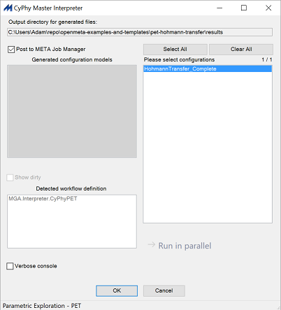

# Hohmann Transfer Example
This example is based on the Hohmann Transfer orbital mechanics example from NASA's OpenMDAO team. The example is detailed in their documentation:
http://openmdao.org/twodocs/versions/2.2.0/examples/hohmann_transfer/hohmann_transfer.html

This OpenMETA model includes a PET with an optimizer, and uses a combination of Python scripts and Excel spreadsheets to accomplish the calculation. The optimizer works to minimize the total Delta-V.

## More Documentation on OpenMETA Features
Comprehensive documentation for the Parametric Exploration capability is available in the OpenMETA Documentation:
http://docs.metamorphsoftware.com/doc/reference_modeling/pet/pet.html

It includes details on how to use specific integrations such as Python, MATLAB, and Excel.

## How to Run It
For this example to run, you'll need to have Microsoft Excel installed on your computer.

1. Double-click on `hohmann-transfer.xme` to load the project. OpenMETA will ask you to save an MGA file. Choose the same folder you loaded the XME from. The MGA file is the "working copy" of your project.
2. In the *GME Browser* at the right, navigate to
    `RootFolder -> Analysis -> ParametricExploration -> HohmannTransfer_Complete`
    and open it by double-clicking.
   
   

3. You will see the workflow open on the Canvas view.
    To run the analysis, click on the *M* icon in the toolbar at top. 
    _This is the *Master Interpreter* used to initiate most analysis work from OpenMETA._

   
   
4. Click *OK* in the *Master Interpreter*'s GUI.

   
   
5. The job will appear in the *OpenMETA Job Manager*. 
    The blue color indicates that it is now running. 
    It will turn green when the job is complete.

   
   
6. Once the job is completed and turns green, double-click it to open the results directory.
    Double-click on the `output.csv` file to see the optimization trace.
    The final row represents the best solution that the optimizer found.
   
   
