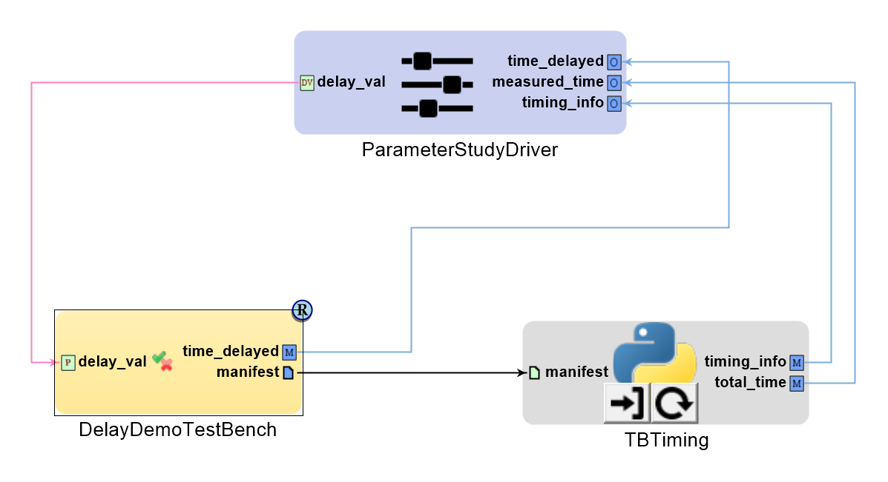

PET and Test Bench Profiling Examples
=====================================

This example includes scripts and example models demonstrating how to measure
the runtime of PET blocks and of Testbench workflows contained within PETs.

PET Block Profiling with run_mdao
---------------------------------

**Note**: PET block profiling requires OpenMETA 0.22.0 or newer.

OpenMDAO contains a built-in profiling tool which measures the runtime of
individual instances of PET components and produces graphs of the results; this
tool is exposed by run_mdao, but is not enabled (for performance reasons) when
running a PET through the Master Interpreter and Job Manager.  The provided
`run_pet_with_profiling.cmd` and `view_pet_profile.cmd` scripts run a given
PET in profiling mode and display the results.

To run a PET in profiling mode:

 1. Open the desired PET (in the example model,
    `Testing/ParametricExporation/PETBlockProfilingDemo`)
 2. Run the Master Interpreter, and select design spaces as needed, but do not
    click OK yet.
 3. Uncheck "Post to META Job Manager" in the top left.
 4. Click OK to generate the PET.
 5. In the GME console, you should see a "Generated files are here:" message.
    Click the linked path to show the results folder in File Explorer, then open
    the selected folder in the window that appears.
 6. In the address bar, type `cmd` to open a command prompt in that folder.
 7. In the command prompt window, run:

        ..\..\run_pet_with_profiling.cmd

    to run the PET with profiling enabled.

When the PET run completes, view the results by running:

    ..\..\view_pet_profile.cmd

This will open a web browser displaying the profiling results as a flame graph,
which breaks down the time spent in the PET run by PET component.  Mouse over
a bar to view the component name, method within that component (e.g. 
`solve_nonlinear`), and total time spent within that method.

Testbench Workflow Profiling Within PETs
----------------------------------------

An example PET PythonWrapper block which takes in a testbench manifest file and
outputs the total time spent running the testbench as well as timing information
for each step within the testbench's workflow is contained in 
`scripts\testbench_timing.py`.  To see an example of how this may be applied, 
run the `Testing/ParametricExploration/DelayDemoPET` PET.

To apply this to your own models, your test bench must be configured to expose
its testbench manifest as an output.  To do so, add a FileOutput to your test
bench and set its "File Name" property to `testbench_manifest.json`.  You can
then add that test bench to a PET, add the `testbench_timing.py` PythonWrapper
to that PET, and connect as shown above.

The `testbench_timing` block exposes two outputs that you may connect to driver objectives or to other PET blocks for further processing.

  * `timing_info` will contain a JSON string including timing information for
    each step in the connected test bench's workflow.
  * `total_time` will contain a number, and is the total time spent in all
    workflow steps within the connected test bench.